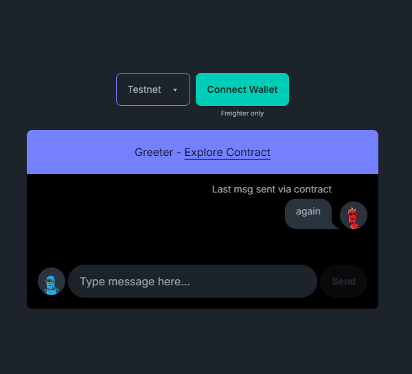

# Our Contract

Understanding our Smart Contract.

## Basics

- Smart Contracts allow users to interact with a blockchain
  - Soroban enables us to create smart contracts in ***Rust*** that interact with the Stellar blockchain.

- For users to interact with a contract they need an account that acts as a form of identification/verification of their activities. This is where wallets come in.

- For the purpose of this tutorial we will be using the [Freighter Wallet](https://www.freighter.app/).


## The Contract

The contract we will be working with is the [**Greeting**](https://github.com/paltalabs/create-soroban-dapp/blob/main/soroban-react-dapp/contracts/greeting/src/lib.rs) contract provided by [Palta labs](https://paltalabs.io/) in their [soroban-example-dapp](https://github.com/paltalabs/create-soroban-dapp) github  repository:

```rust
#![no_std]
use soroban_sdk::{contract, contractimpl, Env, Symbol, symbol_short, String};

const TITLE: Symbol = symbol_short!("TITLE");

#[contract]
pub struct TitleContract;

#[contractimpl]
impl TitleContract {

    pub fn set_title(env: Env, title: String) {
                env.storage().instance().set(&TITLE, &title)
    }

    pub fn read_title(env: Env) -> String {
        env.storage().instance().get(&TITLE)
            .unwrap_or(String::from_str(&env, "Default Title"))
    }

}

mod test;
```

### What does the Contract do?

Dont fret, this may look strange if you're new to the language but it's a straightforward implementation. The contract provides two **public functions** that allows interaction with the blockchain:

- `set_title`
  - This provides a method to write to the blockain. it expects a string.
- `read_title`
  - This provides a method to retrieve the last `"greeting"` for our contract.

Here is link to explore how other people have interacted with the blockchain via this contract -> [Explorer](https://stellar.expert/explorer/testnet/contract/CDWGVPSUXXSGABQ663FVV4TZJH4Q2R3HVAKTKWFFFMWPF23O7KMNS4KU)

:::info

- We will not be running this contract in our app. It has been **deployed** to the blockchain. We can access it via the [`contract address`](https://github.com/paltalabs/create-soroban-dapp/blob/main/soroban-react-dapp/contracts/deployments.json)
- We are working on the Testnet(Test Network).
:::

So based on the above two functions we are going to create an app that ***fetches the last message*** and allows us ***send a message*** as can be seen in the image below:




Now let us make our application by first choosing a framework ⬇️⬇️

## Choose your Framework

import Frameworks from '@site/src/components/Frameworks';

<Frameworks />